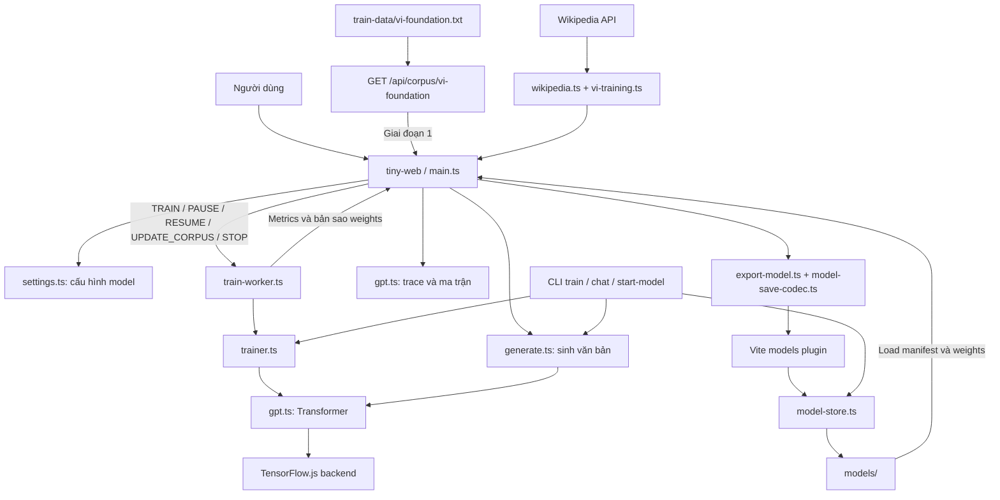
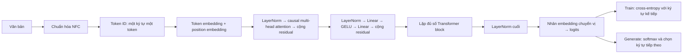
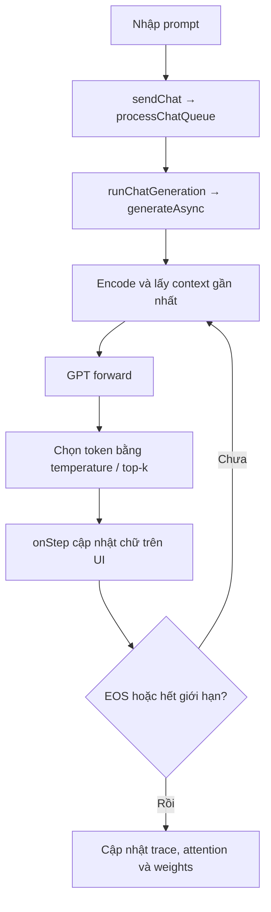

# Kiến trúc LLM-mini

Tài liệu mô tả toàn bộ luồng của source hiện tại: **Tiny LLM** (lõi GPT) và **Tiny Web** (giao diện). Hai package cùng phục vụ ứng dụng tại cổng 5200.

Đây là dự án học cách language model hoạt động: tự định nghĩa Transformer bằng TypeScript và TensorFlow.js, train dự đoán ký tự tiếp theo, sinh văn bản và xem các ma trận. TensorFlow.js thực hiện tính gradient tự động và optimizer Adam; không phải toàn bộ backpropagation đều viết tay.

## 1. Bản đồ tổng thể

Tiến độ VI dùng `plannedEndStep` tuyệt đối được lưu trong curriculum. Bước 2/3 cộng thêm `targetSteps` vào step hiện tại khi bắt đầu đợt mới; tiếp tục đợt chưa xong giữ nguyên mục tiêu. Worker dừng tại mục tiêu này, thanh UI hiển thị step/mục tiêu tổng. Bộ đếm foundation/chat vẫn riêng để kiểm tra điều kiện chuyển giai đoạn.

Chat lưu các cuộc hội thoại trong localStorage (`tiny-chat-sessions-v1`), hỗ trợ New chat và chọn lại history. Prompt ghép các lượt trước bằng nhãn Người dùng/Trợ lý; inference chỉ dùng cửa sổ `contextLength` ký tự gần nhất. Lưu history không tăng context hoặc huấn luyện model. Danh sách checkpoint sắp theo `exportedAt` giảm dần và chọn bản mới nhất khi mở trang; chỉ bấm Load mới nạp weights đã lưu.



Web và CLI dùng chung lõi model. Vite cung cấp API lưu/đọc model trên máy; không có dịch vụ suy luận từ xa hay database trong luồng này.

Browser chat và training Worker yêu cầu backend WebGL, tắt `WEBGL_CPU_FORWARD`; lỗi GPU được báo thay vì tự fallback CPU. CLI vẫn chọn backend riêng. Chat bất đồng bộ pad bên phải tới contextLength (causal attention giữ nguyên dự đoán), đọc xác suất bằng `data()` và làm nóng full context khi tạo/load model để giảm biên dịch shader khi sinh. WebGL có thể dùng driver phần mềm tùy trình duyệt; tên backend không chứng minh GPU vật lý chạy 100%.

## 2. Thư mục và điểm vào

| Đường dẫn | Vai trò |
|---|---|
| `packages/tiny-llm/src/index.ts` | Các export công khai của lõi |
| `packages/tiny-llm/src/vi-curriculum.ts` | Tiến độ nền, phase và fingerprint corpus |
| `packages/tiny-llm/src/config.ts` | Preset, kiểm tra cấu hình, ước lượng tham số/bộ nhớ |
| `packages/tiny-llm/src/tokenizer.ts` | Chuẩn hóa NFC, đổi ký tự ↔ token ID |
| `packages/tiny-llm/src/corpus.ts`, `batches.ts` | Chia dữ liệu train/validation, tạo batch |
| `packages/tiny-llm/src/gpt.ts` | Tham số, forward, loss, trace attention/embedding |
| `packages/tiny-llm/src/trainer.ts` | Gradient, clipping, Adam và weight decay, đánh giá |
| `packages/tiny-llm/src/generate.ts` | Sinh từng ký tự, temperature/top-k |
| `packages/tiny-llm/src/train-worker.ts` | Vòng train nền và giao tiếp với UI |
| `packages/tiny-llm/src/model-io.ts`, `model-store.ts` | Định dạng weights và lưu trên filesystem |
| `packages/tiny-llm/src/cli/` | Train, chat, liệt kê/load model, smoke test |
| `packages/tiny-web/src/main.ts` | Điều phối state, train, chat, lưu/load và các panel |
| `packages/tiny-web/src/vi-training.ts`, `wikipedia.ts` | Charset tiếng Việt, lọc dữ liệu, crawl Wikipedia |
| `packages/tiny-web/src/settings.ts`, `help.ts`, `line-chart.ts`, `style.css` | Cấu hình, hướng dẫn, đồ thị và giao diện |
| `packages/tiny-web/vite.models-plugin.ts` | HTTP API và phục vụ file model |
| `scripts/fetch-vi-corpus.mjs` | Tải corpus CLI vào `train-data/vi-wikipedia.txt` |
| `packages/tiny-llm/test/model.test.ts` | Test tokenizer, batch, model, training và lưu/load |

## 3. Dữ liệu đi qua model như thế nào?



- **Embedding** biến ID thành vector số. Position embedding bổ sung vị trí ký tự.
- **Causal attention** chỉ cho mỗi vị trí nhìn các vị trí hiện tại và phía trước nó trong chuỗi, không nhìn ký tự tương lai.
- **Residual** cộng đầu vào trở lại đầu ra của attention/FFN để giữ thông tin qua nhiều lớp.
- **Logits** là điểm số chưa chuẩn hóa cho từng token. Output dùng chung trọng số với token embedding.

Kích thước chính: input `[B, T]` → hidden `[B, T, D]` → logits `[B, T, V]`. `B` là batch size, `T` là số token trong context, `D` là `dModel`, `V` là vocab size. `dModel` phải chia hết cho số attention heads.

## 4. Luồng training

```mermaid
sequenceDiagram
    participant UI as UI main.ts
    participant W as Train Worker
    participant T as Trainer
    participant M as GPT / TensorFlow.js
    UI->>W: TRAIN(config, vocab, lines, weights, startStep)
    W->>W: Chọn backend, tạo model, import weights
    W->>T: Encode train/val thành token stream
    W-->>UI: STARTED
    loop Đến khi nhận STOP
        T->>T: Sample x và y lệch nhau một ký tự
        T->>M: Forward → loss → variableGrads
        T->>M: Clip gradient → Adam → weight decay
        W-->>UI: PROGRESS(loss, step, metrics, weights nếu có)
        UI->>W: UPDATE_CORPUS khi có thêm dữ liệu
    end
    UI->>W: PAUSE
    W-->>UI: PAUSED và weights; giữ optimizer/RNG
    UI->>W: RESUME
    W-->>UI: RESUMED
    UI->>W: STOP
    W-->>UI: STOPPED và weights cuối
    UI->>UI: Pause giữ Worker và optimizer; Stop lưu model
```

Mỗi dòng được encode thành `<BOS> nội dung <EOS>`, rồi nối thành stream. `sampleBatch()` lấy các cửa sổ ngẫu nhiên; target `y` là chuỗi dịch một vị trí so với `x`. Một step là một lần cập nhật weights, không phải một lần đọc hết corpus.

Worker đánh giá validation khoảng mỗi 5 giây. Model không quá 2 triệu tham số gửi bản sao weights về UI khoảng mỗi 2 giây; model lớn hơn chỉ gửi weights khi dừng. Đây là các khoảng kiểm tra trong vòng lặp, không phải lịch thời gian chính xác.

**Training tiếng Việt gồm hai giai đoạn:** cả hai giữ kiến trúc/hyperparameter dynamic đã chọn; khi bắt đầu VI chỉ thay vocab nếu cần. bước 1 đọc `train-data/vi-foundation.txt` qua `GET /api/corpus/vi-foundation`, kiểm tra SHA-256, chia hold-out cố định và train đến mốc (mặc định 3.000 bước). Chưa gọi Wikipedia. Worker nhận `endStep` để tự dừng chính xác và UI lưu tiến độ `viCurriculum` trong metadata. Bước 2 do người dùng bấm sau khi đạt mốc: nhập link `vi.wikipedia.org`, giữ model/vocab/weights, giữ corpus nền và bổ sung Wikipedia. Không đưa dòng hold-out vào train. `vi-curriculum.ts` quản lý mốc/phase/fingerprint; checkpoint cũ không có metadata không được tính các step cũ thành step nền. Xem [hướng dẫn](docs/training-vietnamese.md).

**CLI:** `cli/train.ts` đọc `.txt`/`.json` hoặc sinh phép tính nếu thiếu `--corpus`, chia dữ liệu, tạo/load model, chạy số step yêu cầu và lưu kết quả. CLI hiện dùng `lineAccuracy()` (đúng hoàn toàn phần tiếp nối), còn UI dùng `evalTokenAccuracy()` (đúng ký tự nội dung); hai giá trị `valAcc` không tương đương.

## 5. Luồng chat và quan sát model



Chat hiện chạy `generateAsync()` trên luồng UI, sử dụng bản model đã đồng bộ từ Worker. `chat-worker.ts` có sẵn nhưng chưa được `main.ts` sử dụng. Lịch sử chat dùng để hiển thị/hàng đợi; mỗi lần sinh chỉ nhận prompt của lượt đó, không tự ghép cả lịch sử hội thoại.

Các panel gọi hàm trace trong `gpt.ts` để xem token, embedding, attention, xác suất và weights. Model là bộ sinh phần tiếp nối văn bản; giao diện chat không tự biến nó thành trợ lý đã instruction-tune. UI hiển thị accuracy đo được, không áp ngưỡng 85% để tuyên bố hiểu tiếng Việt.

## 6. Lưu và load model

UI serialize model → đóng gói metadata/manifest/weights bằng `model-save-codec.ts` → gọi Vite API → `model-store.ts` ghi file.

| Method / route | Chức năng |
|---|---|
| `GET /api/corpus/vi-foundation` | Đọc corpus nền local (UTF-8) |
| `GET /api/models/list` | Gộp model thường và export phiên bản cũ |
| `POST /api/models/save` | Lưu vào `models/<tên>/`, hỗ trợ payload nhị phân có Unicode |
| `POST /api/models/export` | Đường lưu versioned export cũ |
| `GET /api/models/index` | Đọc index của versioned exports |
| `/models/...` | Phục vụ manifest, metadata và weights để load |

Một model gồm `model.json` (format `tiny-gpt/v1`, config, vocab, tensor layout), `weights.bin` (Float32) và metadata khi lưu qua store. UI hiện lưu dưới `models/<tên>/`; CLI lưu `--out` và thêm bản versioned dưới `models/exports/`.

Load đọc manifest và weights, tạo lại model đúng config/vocab rồi import weights theo thứ tự tham số. Metadata có `viCurriculum` để khôi phục phase và tiến độ nền; corpus/hold-out nền được tái tạo từ file đã pin. Checkpoint **không chứa trạng thái Adam, RNG hay corpus**; resume tiếp tục từ weights, không khôi phục toàn bộ phiên tối ưu trước. CLI ghi step của lượt chạy mới, không cộng dồn step cũ.

Plugin được gắn vào Vite dev và preview. Chỉ deploy các file build tĩnh sẽ không có API lưu/load này.

## 7. Runtime và lệnh chính

Browser chọn WebGL nếu dùng được → WASM → CPU; Worker cần OffscreenCanvas để thử WebGL. Browser từ chối cấu hình có bộ nhớ train ước lượng vượt 512 MB, kể cả khi số tham số nhỏ. WASM browser tải binary từ CDN. Node thử `tfjs-node-gpu` → `tfjs-node` → WASM → CPU; GPU không được bảo đảm chỉ vì có preset lớn.

Chạy từ root, Node.js >= 22:

```bash
npm install
npm run dev:tiny             # Web: http://localhost:5200
npm run build               # Build core rồi web
npm run test:tiny           # Unit tests
npm run verify:tiny         # Smoke test model, có training
npm run models:list
npm run fetch:vi-foundation  # Tải/lọc corpus nền (Python 3)
npm run fetch:vi-corpus -- --articles 30
npm run train:tiny -- --preset small --corpus train-data/vi-wikipedia.txt --steps 3000 --out models/vi-small
npm run chat:tiny -- --model models/vi-small
```

Đọc [AGENT.md](AGENT.md) để biết vị trí sửa code và các ràng buộc cần giữ.


### Đánh giá chat

Bước 2 dùng corpus hội thoại riêng. Không append vài chục dòng chat vào toàn bộ corpus nền: trainer lấy mẫu theo token nên tin tức sẽ lấn át. Hold-out foundation vẫn dùng làm phép đo hồi quy ngôn ngữ, không đại diện cho chất lượng chat. `scripts/evaluate-vi-chat.mts` tạo checkpoint riêng, sinh câu trả lời greedy ở các mốc và lưu `evaluation.json`; không ghi đè checkpoint đầu vào.
