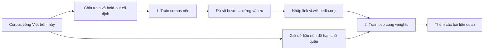

# Training tiếng Việt: ký tự nền → hội thoại cơ bản → Wikipedia

## Dữ liệu đã có

`train-data/vi-foundation.txt`: 81.995 câu, khoảng 13,2 MB, lọc từ bản **Vietnamese News 2020 — 100K** của Leipzig Corpora Collection. Xem [nguồn, xử lý và giấy phép](../train-data/README.md). Chỉ chọn nguồn tiếng Việt, không ghép corpus tiếng Anh/song ngữ; bộ lọc không bảo đảm loại bỏ mọi tên riêng/từ ngoại lai.

Nếu thiếu file, chạy `npm run fetch:vi-foundation` (Python 3, lần đầu cần mạng).

## Luồng UI được hỗ trợ



1. Chạy `npm run dev:tiny`, mở `http://localhost:5200`.
2. Nếu muốn tiếp tục model, chọn **Load** trước. Model cũ không có metadata curriculum bắt đầu đếm tiến độ corpus nền từ 0; tổng step cũ vẫn được giữ.
3. Nhập **Số bước corpus nền**, mặc định 3.000, bấm **1. Train corpus tiếng Việt**. Chỉ đọc file local; chưa gọi Wikipedia.
4. Đủ số bước, Worker dừng chính xác ở mốc và UI lưu checkpoint. Có thể Pause/Resume hoặc Stop/Load để tiếp tục phần còn lại. Muốn luyện thêm, tăng mốc tổng bước corpus nền rồi bấm bước 1.
5. Xem câu model sinh và validation. Mốc bước chỉ là kế hoạch luyện tập, không chứng nhận “đã hiểu tiếng Việt”.
6. Nhập link, ví dụ `https://vi.wikipedia.org/wiki/Hà_Nội`, bấm **2. Train tiếp Wikipedia**. Nút chỉ mở khi đã đạt mốc corpus nền; URL ngoại ngữ bị từ chối.
7. Giai đoạn 2 giữ model/vocab/weights, nạp lại corpus nền và thêm bài Wikipedia. Hold-out nền được tái tạo cố định, không đưa vào train. Tiếp tục crawl các bài liên quan đến khi Stop hoặc hết nguồn truy cập được.
Phase hội thoại phải chạy sau foundation và trước Wikipedia. Dữ liệu mẫu nằm ở [`train-data/vi-chat-basic.txt`](../train-data/vi-chat-basic.txt). Mỗi dòng là một cặp `Người dùng ... = Trợ lý ...`; Đánh giá câu trả lời định kỳ; số bước không phải chứng nhận hiểu tiếng Việt.

Model giữ cấu hình dynamic đã chọn trong Settings (layers, width, heads, FFN, context, batch, LR, dropout), chỉ thay vocab sang charset tiếng Việt cố định khi cần. Nếu đã Load model có charset VI thì giữ model đó. Không tự chọn checkpoint bất kỳ chỉ vì checkpoint ấy có step cao.

## Lưu và khôi phục

UI lưu `models/<tên>/model.json`, `weights.bin`, `meta.json`. Metadata có `viCurriculum`: corpus fingerprint, phase, số bước nền, mốc bước nền và link Wikipedia. Pause/Resume cùng phiên giữ Worker và optimizer/RNG. Stop/Load dùng optimizer mới vì checkpoint không lưu Adam/RNG/corpus; khi load, corpus nền và hold-out được tái tạo từ file đã pin, còn Wikipedia được tải lại khi bấm bước 2.

Vite dev/preview phục vụ corpus qua `GET /api/corpus/vi-foundation`; không sao chép 13 MB dữ liệu vào bundle web. Lưu/load cần API Vite. Mất mạng không ảnh hưởng việc đọc corpus nền nếu backend TF.js sẵn có; backend WASM có thể cần tải binary từ CDN.

## CLI cơ bản

```bash
npm run train:tiny -- --preset small --corpus train-data/vi-foundation.txt --steps 3000 --out models/vi-foundation-cli
npm run fetch:vi-corpus -- --articles 30
npm run train:tiny -- --resume models/vi-foundation-cli --corpus train-data/vi-wikipedia.txt --steps 3000 --out models/vi-wiki-cli
npm run train:vi-chat  # chuẩn bị corpus hội thoại riêng rồi fine-tune checkpoint
```

Đây là CLI tổng quát: vocab build từ corpus đầu; ký tự lạ trong corpus sau thành UNK, không tự mở rộng vocab. CLI không điều phối curriculum/giữ replay như UI và không ghi chứng nhận hoàn tất giai đoạn nền để mở nút Wikipedia. Muốn đúng luồng hai giai đoạn, charset cố định và replay đã tích hợp, dùng UI. Resume CLI bắt buộc `--corpus` để tránh vô tình train model tiếng Việt bằng phép tính.

UI báo độ chính xác ký tự hold-out; CLI hiện báo độ chính xác toàn phần tiếp nối. Không so sánh trực tiếp hai metric.

## Kiểm tra thay đổi

```bash
npm run test:tiny
npm run build
```

Mục tiêu là mô hình thử nghiệm học ký tự/từ/câu. Dataset này và Wikipedia không tự biến model nhỏ thành chatbot hiểu yêu cầu hay trả lời kiến thức đáng tin cậy.

Khi đang train, bấm Pause để chat bằng weights mới nhất. Save/Load/đổi cấu hình được khóa trong các thao tác xung đột; Load lỗi giữ nguyên model đang có. Reset weights giữ kiến trúc/charset nhưng xóa tiến độ nền. UI chỉ hiển thị accuracy đo được, không có ngưỡng 85% chứng nhận khả năng ngôn ngữ.


## Kiểm tra hội thoại thực tế

Phase chat dùng riêng dữ liệu hội thoại. Trước đây 33 dòng hội thoại bị trộn với gần 82.000 dòng tin tức, chỉ chiếm khoảng 0,028% ký tự; tăng step chủ yếu tiếp tục học tin tức. Validation nền vẫn đo trên tin tức để theo dõi thay đổi khả năng ngôn ngữ, không phải chat accuracy.

Chạy thử nghiệm có lưu kết quả trước/sau (native TensorFlow nếu có):

```bash
node --import tsx/esm scripts/evaluate-vi-chat.mts models/TEN_CHECKPOINT
```

Script lưu model vào thư mục mới và `evaluation.json` chứa câu trả lời ở từng mốc. Bộ câu hỏi có cả mẫu trong train và cách hỏi chưa có trong corpus. Trả lời được vài mẫu không chứng minh khả năng đối thoại tổng quát hoặc nhớ ngữ cảnh dài; model đang kiểm tra chỉ có context 64 ký tự.
